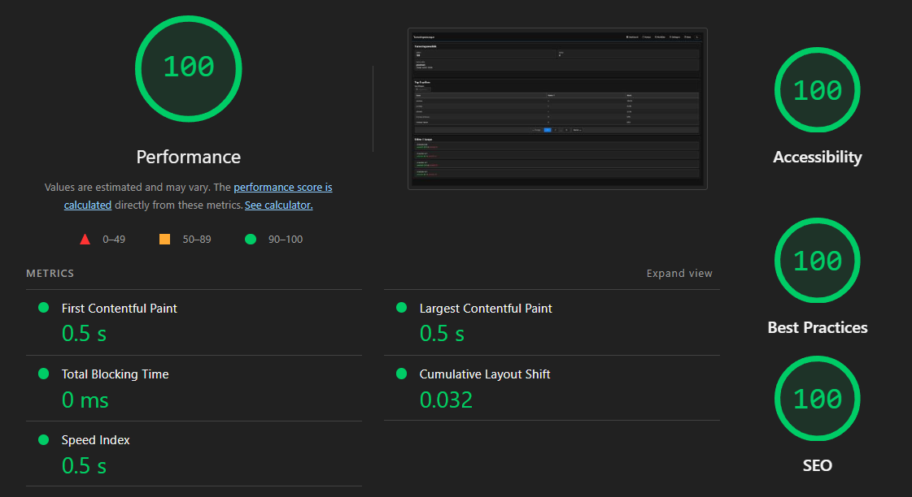

# Turneringshåndterings-Webapp

## Arkitektur

```mermaid
flowchart LR
    Bruger[Bruger]

    subgraph Frontend
        direction TB
        Views[Views og Components]
        Stores[States]
        Views --> Stores
    end

    subgraph Backend
        direction TB
        Controllere[API Controllere]
        Modeller[Modeller]
        Controllere --> Modeller
    end

    DB[(Database)]

    Bruger --> Frontend
    Frontend -->|HTTP/REST| Backend
    Backend --> DB

    style Bruger fill:#374151,stroke:#9CA3AF,stroke-width:2px    
    style Frontend fill:#064E3B,stroke:#41B883,stroke-width:2px
    style Views fill:#1F2937,stroke:#34D399,stroke-width:1px
    style Stores fill:#1F2937,stroke:#34D399,stroke-width:1px
    style Backend fill:#1E3A8A,stroke:#60A5FA,stroke-width:2px
    style Controllere fill:#1F2937,stroke:#93C5FD,stroke-width:1px
    style Modeller fill:#1F2937,stroke:#93C5FD,stroke-width:1px
    style DB fill:#202028,stroke:#ffffff,stroke-width:2px
```



<div align="center">
  
</div>

## Teknisk Dokumentation

### Design Patterns

| Pattern | Beskrivelse | Anvendelse |
| --------- | ------------- | ------------ |
| **Pinia Store** | State management | `deltagerStore.ts`, `kampStore.ts` |
| **Repository Pattern** | En slags "Datamanager" som håndterer alle API kald | Pinia stores fungerer som repositories |
| **MVC (Model-View-Controller)** | Backend logik | Vue komponenter (View) <-> Stores (Controller) <-> API (Model) |
| **Code Splitting** | Dynamisk import af routes | Lazy loading via `router.ts` |
| **Composition API** | Logik via composables | `useRanklisteStats.ts`, `useRoutePreload.ts` |

---

&nbsp;

### Installationsguide

#### Værktøjs krav

| Værktøj | Version |
| --------- | -------- |
| Node.js | 24 LTS |
| .NET | 10.0 |
| MySQL | 15.1 |

&nbsp;

#### 1: Klon projektet

```bash
git clone https://github.com/aqys/GUI-Projekt
cd GUIProjekt
```

#### 2: Database opsætning

1 - Start MySQL server

2 - Opret database og tabeller

```sql
CREATE DATABASE IF NOT EXISTS tunering;
USE tunering;

CREATE TABLE spillere (
    id INT AUTO_INCREMENT PRIMARY KEY,
    navn VARCHAR(255) NOT NULL
);

CREATE TABLE kampe (
    id INT AUTO_INCREMENT PRIMARY KEY,
    spiller1 INT,
    spiller2 INT,
    score1 INT,
    score2 INT,
    
    CONSTRAINT fk_sp1
        FOREIGN KEY (spiller1)
        REFERENCES spillere(id),
    
    CONSTRAINT fk_sp2
        FOREIGN KEY (spiller2)
        REFERENCES spillere(id)
);
```

3 - Opret database bruger:

```sql
CREATE USER 'tuneringskonto'@'localhost' IDENTIFIED BY 'AdminTest123!';
GRANT ALL PRIVILEGES ON tunering.* TO 'tuneringskonto'@'localhost';
FLUSH PRIVILEGES;
```

4 - Connection string (allerede konfigureret i `appsettings.json`):

```text
Server=127.0.0.1;Port=3306;Database=tunering;User=tuneringskonto;Password=AdminTest123!;SslMode=None;
```

&nbsp;

#### 3: Installer dependencies

```bash
# frontend
cd ./guiprojekt.client
npm install

# backend
cd ../GUIProjekt.Server
dotnet restore
```

#### 4: Kør projektet

**Start backend (Starter også frontend):**

```bash
cd ../GUIProjekt.Server
dotnet run --launch-profile https
```

Backend kører på: `https://localhost:7156`

Frontend kører på `https://localhost:57051`, men videresender automatisk alle api kald til backend via proxy (Vite). Du behøver kun at starte backend, frontend startes automatisk.

**Start frontend:**

```bash
cd ../guiprojekt.client
npm run dev
```

---

&nbsp;

### API Dokumentation

API er tilgængeligt på `/api/v1/`

#### Spiller API

| Method | Endpoint | Beskrivelse | Body |
| -------- | ---------- | ------------- | -------------- |
| `GET` | `/api/v1/spillere` | Hent alle spillere | - |
| `POST` | `/api/v1/spillere` | Opret ny spiller | `{"navn": "string"}` |
| `PUT` | `/api/v1/spillere/{id}` | Opdater spiller | `{"navn": "string"}` |
| `DELETE` | `/api/v1/spillere/{id}` | Slet spiller | - |

```bash
curl https://localhost:7156/api/v1/spillere

curl -X POST https://localhost:7156/api/v1/spillere \
  -H "Content-Type: application/json" \
  -d '{"navn": "Test spiller"}'
```

&nbsp;

#### Kamp API

| Method | Endpoint | Beskrivelse | Body |
| -------- | ---------- | ------------- | -------------- |
| `GET` | `/api/v1/kampe` | Hent alle kampe | - |
| `POST` | `/api/v1/kampe` | Registrer kamp | `{"vinder": "string", "taber": "string", "vinderScore": number, "taberScore": number, "tidspunkt": "string"}` |
| `PUT` | `/api/v1/kampe/{id}` | Opdater kamp | `{"vinder": "string", "taber": "string", "vinderScore": number, "taberScore": number, "tidspunkt": "string"}` |

```bash
curl https://localhost:7156/api/v1/kampe

curl -X POST https://localhost:7156/api/v1/kampe \
  -H "Content-Type: application/json" \
  -d '{"vinder": "Test spiller 1", "taber": "Test spiller 2", "vinderScore": 5, "taberScore": 2, "tidspunkt": "2026-04-30 10:00"}'
```

**Regler:**

- Vinder og taber må ikke være samme spiller
- Vinder score skal være højere end taber score
- Spillerne skal eksistere i databasen

---

&nbsp;

## Brugerdokumentation

### Brugervejledning

#### Navigation

Webapp'en har følgende sider (kan tilgås via navbar):

1. **Dashboard** (`/`) - Overblik
2. **Kampe** (`/kampe`) - Se og registrer kampe
3. **Rankliste** (`/rankliste`) - Se spillere rankliste
4. **Deltagere** (`/deltagere`) - Administrer spillere
5. **Statistik** (`/stats`) - Statistik

#### Sådan registrerer du en kamp

1. Gå til **Kampe** siden
2. Klik på **"Registrer Kamp"** knappen
3. Udfyld formularen:
   - Vælg vinder fra dropdown
   - Vælg taber fra dropdown
   - Indtast point for vinder og taber
   - Vælg dato og tidspunkt
4. Klik **"Gem"** for at registrere

#### Sådan tilføjer du en ny spiller

1. Gå til **Deltagere** siden
2. Klik på **"Tilføj Spiller"** knappen
3. Indtast spillerens navn
4. Klik **"Gem"**

---

&nbsp;

## TODO

`Opdater løbende`

- [x] Tilføj stores
- [x] Opdater komponenter til at hente data fra stores
- [x] Tilføj nye komponenter og style dem
- [x] Tilføj logik i de nye komponenter
- [x] Koble op til DB
- [x] Gem data i DB
- [x] Arbejdt lidt mere på UI delen
- [x] Videreudvikle home page
- [x] Sæt routing op
- [x] Tilføj ikoner
- [x] CRUD
- [x] Input validation og error handling
- [x] Code splitting
- [x] Grafer
- [x] Responsivt UI
- [x] Light mode (kan skifte mellem)
- [x] Opdater README/Dokumentation
- [x] Pagination på RanklisteView (RanklistTable)
- [x] Unit tests
- [x] Opnå 100-100-100-100 i Google Lighthouse
- [x] Arkitektur diagram
- [ ] Auth (maybe)
- [ ] Tjek alt igennem
- [ ] Færdiggør README/Dokumentation
